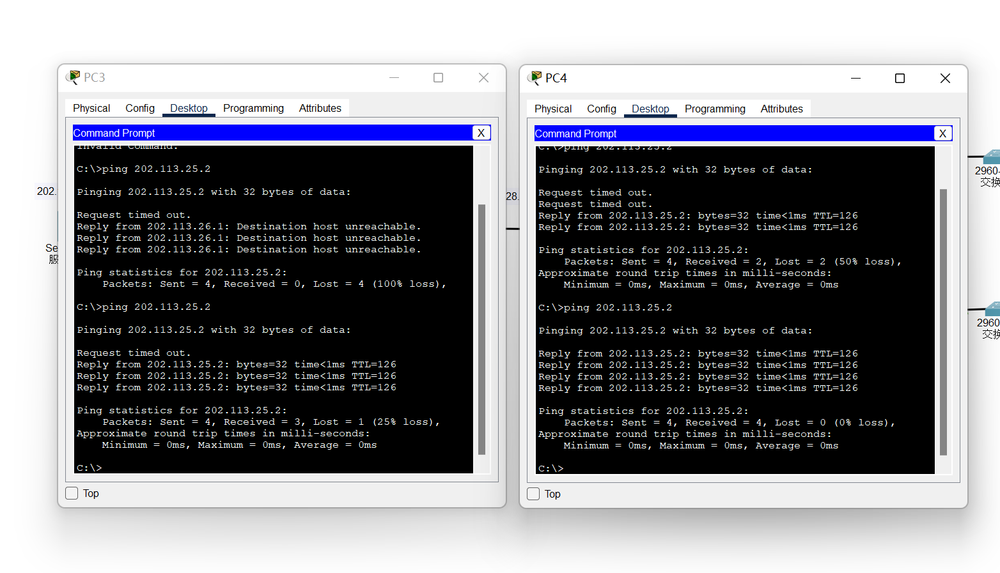
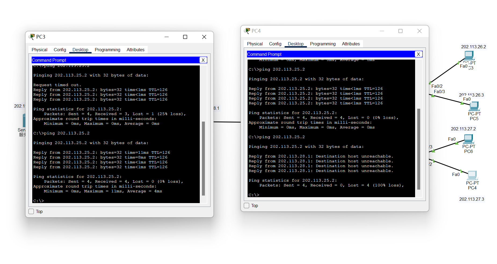
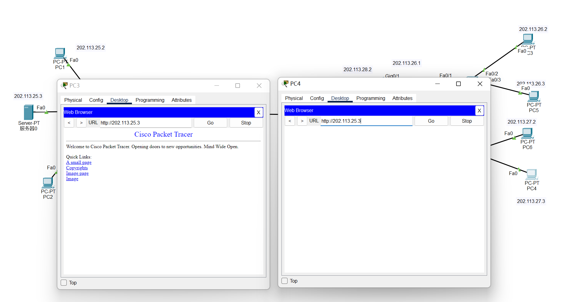
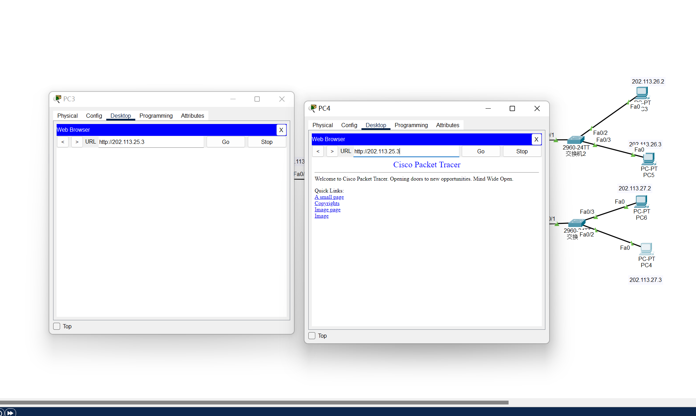
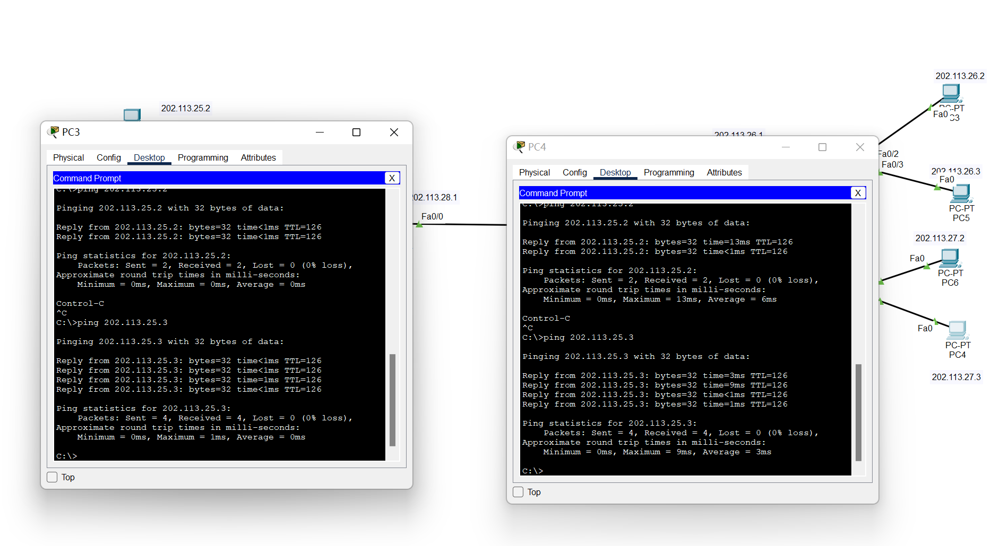

## 防火墙和SSL实验

​											 姓名:李佳豪 	学号：2111252 	时间: 2023 12.12

[TOC]

#### 实验一:防火墙实验

##### 1、实验说明

防火墙实验在虚拟仿真环境下完成，要求如下：（1）了解包过滤防火墙的基本配置方法、配置命令和配置过程。（2）利用标准ACL，将防火墙配置为只允许某个网络中的主机访问另一个网络。（3）利用扩展ACL，将防火墙配置为拒绝某个网络中的某台主机访问网络中的Web服务器。（4）将防火墙配置为允许内网用户自由地向外网发起TCP连接，同时可以接收外网发回的TCP应答数据包。但是，不允许外网的用户主动向内网发起TCP连接。

##### 2、实验过程--标准访问控制列表

1. 网络拓扑图

2. 配置虚拟环境各个主机ip、三个路由表的接口ip地址如批注中所示，并配置三台路由器的路由表项目，使得四个网络处处连通

   ​	左侧PC3（202.113.26.2），ping 可以ping 202.113.25.2通

   ​	右侧PC4（202.113.27.3），ping 可以ping 202.113.25.2通

   ​	

3. 配置、绑定左侧路由表的标准访问控制列表

   - 在全局配置模型下，进入access-list 设置规则（列表号在1-99选取）, 这两天规则的作用，

     > `access-list listNo permit 202.113.26.0  0.0.0.255`
     >
     > `access-list listNo deny any`

   - 进入右侧INC配置模式，绑定刚刚配置的规则它的入站规则

     >`ip access-group listNo in`

4. 检验结果

   左侧PC3（202.113.26.2），可以ping通，因为他在刚刚配置路由表右侧INC的入站规则里；

   右侧PC4（202.113.27.3），不可以ping通，因为刚刚配置的路由表检查这个源ip不在运行的源ip里。

   

##### 3、实验过程--扩展访问控制列表
1. 网络拓扑如刚刚所展示，目的在设置规则拦截某些主机对左侧网络Web服务器的访问，我们现在使用PC3和PC4对左侧服务器进行访问，PC3可以、PC4不行,其原理和刚刚ping时一样，除了202.113.26.0网络的包都被过滤。**先不对上述标准控制列表的规则进行解除，继续实验。**

   

2. 配置左侧路由器

   - ​	首先进入全局模式下，listNo在 (101 199)  两个any分别是源ip和目的ip

     > `access-list listNo deny tcp host 202.113.26.2 host 202.113.25.3 eq 80`
     >
     > `access-list listNo permit ip any any`

   - 进入右侧INC配置模式，绑定刚刚配置的规则它的入站规则

     > `ip access-group listNo in`

3. 结果验证

   左侧PC3（202.113.26.2），不可以访问；右侧PC4（202.113.27.3），可以访问

   这实际上是符合我们刚添加的扩展规则的，

   

   

##### 4、实验结论、思考

此时使用PC3和PC4对左侧网域中使用ping命令，PC3可以ping通（无论是标准列表里的规则还是扩展里的规则都允许），发现PC4也可以ping通（根据标准规则是不可以的），说明我们扩展规则中添加的第二条规则permit any any 的优先级更高；

这里其实是有疑问的，因为似乎扩展访问规则覆盖了先进行声明的标准访问规则

可以猜测，路由器内部将这些规则组织成表格，上方是最新添加的扩展控制列表，而下面是旧的标准控制列表规则，那么可以猜测这个路由程序实际是从上到下遍历这个表，匹配成功的直接通过；

不妨删除、重新绑定一次"旧的"标准控制列表，让它置于“access-lists”的最上方

~~~bash
no access-list 1
access-list listNo permit 202.113.26.0  0.0.0.255
access-list listNo deny any
interface fa0/0
no ip access-group 6 in
ip access-group 6 in
~~~

再次使用PC3、4访问左侧服务器、ping左侧网段，发现和刚开始只有标准访问列表的结果一模一样(PC3正常访问，PC4不能)，因为标准访问列表对ip的过滤，实际完全涵盖了扩展列表的规则；

因此这些迹象表明防火墙规则的设置需要考虑规则**协议层次**和在绑定`access-list`的**顺序**；但具体原理还得参考思科路由器内部对ACL实现的逻辑。

#### 实验二:SSL实验
##### 1、实验说明

SSL实验在实体环境下完成，要求如下：（1）完成Web服务器的证书生成、证书审批、证书安装、证书允许等整个过程。（2）实现浏览器与Web服务器的安全通信。

##### 2、实验过程