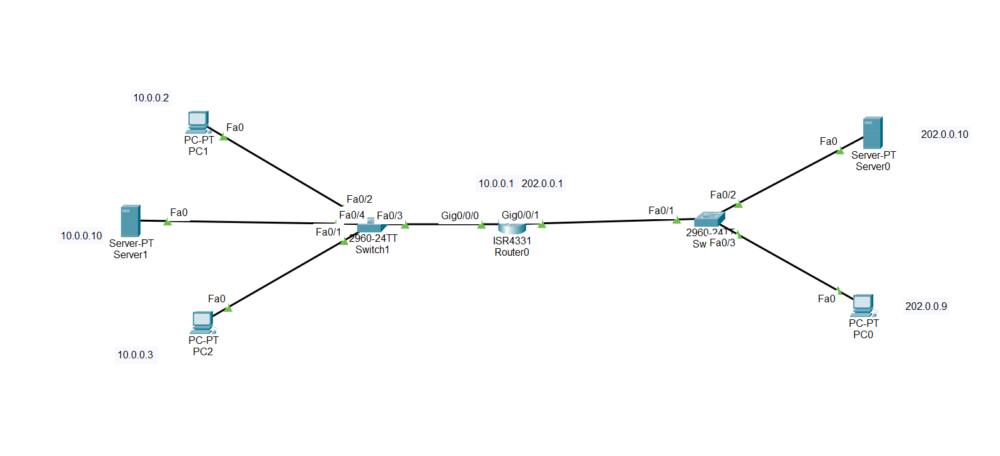
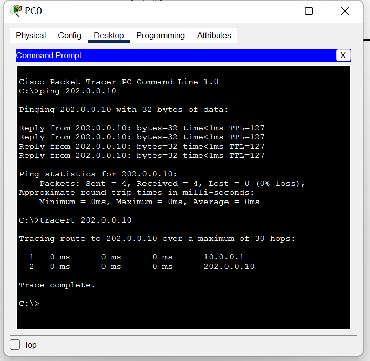
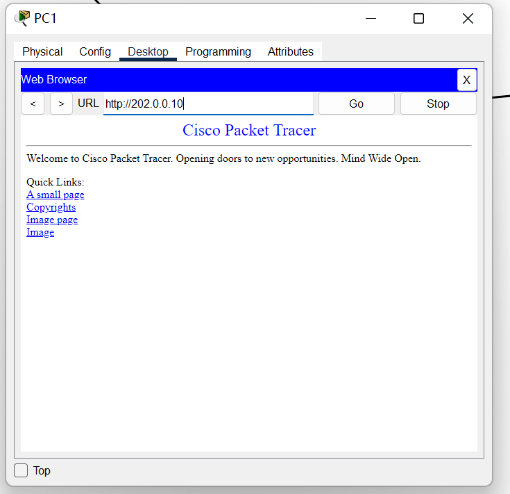
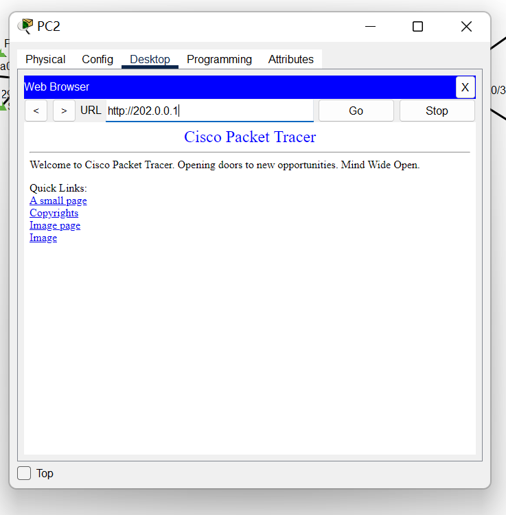
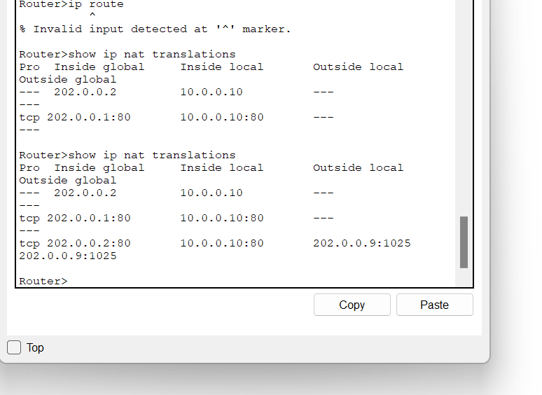
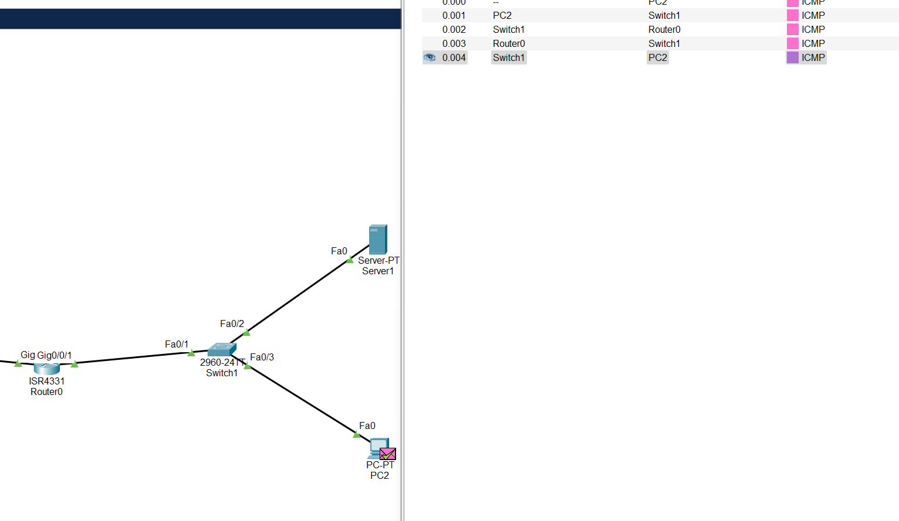
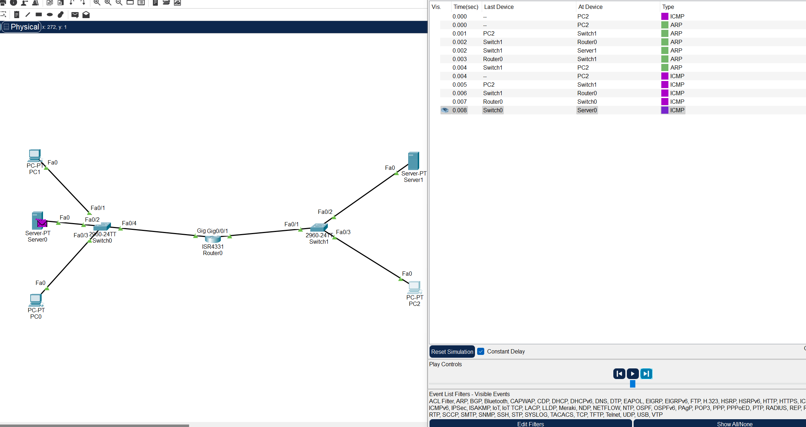

## **LAB 6: NAT**

​													学号: 2111252     姓名: 李佳豪    时间: 12.6

[TOC]

#### 实验内容

##### 1. 仿真环境下的NAT服务器配置

在仿真环境下完成NAT服务器的配置实验，要求如下：（1）学习路由器的NAT配置过程。（2）组建由NAT连接的内网和外网。（3）测试网络的连通性，观察网络地址映射表。（4）在仿真环境的“模拟”方式中观察IP数据报在互联网中的传递过程，并对IP数据报的地址进行分析。

##### 2. 在仿真环境下完成如下实验

将内部网络中放置一台Web服务器，请设置NAT服务器，使外部主机能够顺利使用该Web服务

#### 环境配置与结果

1. #### 网络拓扑如下

   

2. #### 配置路由器：

   1. ###### 进入配置模式，对内网接口ip设置，左侧内网gig0 10.0.0.1 右侧gig1 202.0.0.1

      ~~~shell
      
      ### 先enable进入特权模式，config terminal进入全局配置：
      Router(config)#interface gig0/0/0
      Router(config-if)#ip address 10.0.0.1 255.0.0.0
      Router(config-if)#no shutdown
      
      Router(config-if)#
      %LINK-5-CHANGED: Interface GigabitEthernet0/0/0, changed state to up
      
      %LINEPROTO-5-UPDOWN: Line protocol on Interface GigabitEthernet0/0/0, changed state to up
      Router(config-if)#exit 
      Router(config)#interface gig0/0/1
      
      Router(config-if)#ip address 202.0.0.1 255.255.255.0
      Router(config-if)#no shutdown
      
      Router(config-if)#
      %LINK-5-CHANGED: Interface GigabitEthernet0/0/1, changed state to up
      
      %LINEPROTO-5-UPDOWN: Line protocol on Interface GigabitEthernet0/0/1, changed state to up
      
      ~~~

      ​	**特别**对命令`ip nat inside source list 6 pool FondPool overload`将内部网络的私有 IP 地址映射到一个全局 IP 地址池，`overload`表示使用 NAPT（Network Address Port Translation）方式进行转换，即允许多个内部主机共享同一个全局 IP 地址，通过不同的端口进行区分。

      ​	其实一开始这里有疑问了，因为Http等协议要求通过特定的端口进行传输，若此时内网若有两个Http服务器，但他们都映射到一个全局IP地址，而端口也都得80，即会冲突。不过后面得知，配置静态一对一的IP映射也是可以的，也就是后半部分实验中涉及的。

   2. ###### 设置nat地址池、需要进行映射的内网ip列表

      ~~~shell
      Router(config-if)#exit
      
      Router(config)#ip nat pool FondPool 202.0.0.1 202.0.0.5 netmask 255.255.255.0
      Router(config)#access-list 6 permit 10.0.0.0 0.255.255.255
      Router(config)#ip nat inside source list 6 pool FondPool overload
      ~~~

   3. ##### 指定内网、外网接口

      ~~~shell
      Router(config)#interface gig0/0/0
      Router(config-if)#ip nat inside
      Router(config-if)#exit
      
      Router(config)#interface gig0/0/1
      Router(config-if)#ip nat outside
      Router(config-if)#exit
      ~~~

   ​		

   4. ###### 静态设置内网内服务器的映射，使得向外网开放服务

      - ###### 由于只开放WEB服务，如果只考虑Http，仅需要将服务器的80端口开放给外网；

        ~~~shell
        Router(config)#Ip nat inside source static tcp 10.0.0.10 80 202.0.0.1 80
        ~~~

        

      - ###### 也可以考虑将服务器整个IP开放给外网访问；注意映射后的ip不同于原路由ip，但得在nat pool范围内。

        ~~~shell
        Router(config)#Ip nat inside source static 10.0.0.10 202.0.0.2 
        ~~~

        ​			

3. #### 结果验证

   1. ##### 内网对外网PC  `Ping `和 `tracert`测试

      

      

   2. ##### 内网对外网服务器访问

      

      

   3. ##### 内网开放服务器，外网进行Web访问考虑两种映射方式:

      - 只考虑将内网服务器TCP的**80端口**做静态映射，那么外网访问内网服务器可以成功

        

        

      - 考虑将内网服务器的**IP**静态映射，同样可以成功； 清除缓存，重启软件，使用外网PC访问内网服务器**前后**执行`show ip nat translations`，可以看到Web服务器正确转换成202.0.0.2的ip，当tcp协议时，端口号为对应ip+80；

        
        
        
        
        

4. ###### 静态映射端口和映射IP的区别：

   ​		二者区别在于映射IP使得所有外界通过传输层协议就可以和内网服务器进行交互，例如当使用Ping命令，外网可以直接通过ping这个映射的静态IP直接收到服务器的回复，但若只是映射80端口，我们无法从Ping等IP层协议和服务器建立联系。

   1. 若是静态映射端口，可以看到ICMP报文无法真正到达内网服务器，在路由即进行ICMP的回复。

     

   2. 若是静态映射IP，同样在执行Ping命令时候，首先在ARP协议路由器获得了下一跳（目的ip是内网静态映射的ip，与路由器外网ip不同，返回路由器的mac），进而发送ICMP报文，且确实内网服务器最后收到、然后回复。

     

​			

​     

#### 实验思考、结论

​	实验是对理论课NAT模式的补充，NAT产生的背景是由于IP紧缺，因此可以通过IP + 端口的形式，将一片网络共享一个IP，通过不同端口进行识别；但是伴随的问题是外界对这片网络某一台特定主机的主动访问变得麻烦，因为内部NAT下的映射关系在内网边缘的路由器里记录， 但也使得内网实现了真正的内，与外界隔离；在此之前软件安全课上曾提到过内网穿透的问题，当时并不清楚这个问题提出的背景。
​			此外，对于内网服务器开放到外网，这里我在网上搜索了两种方式，一种是仅仅将tcp端口做静态映射，一种是将内网某个ip做静态映射，由于tcp建立在ip之上，后者应该是包括前者的，但是前者提供的隔离性更高，更安全？

