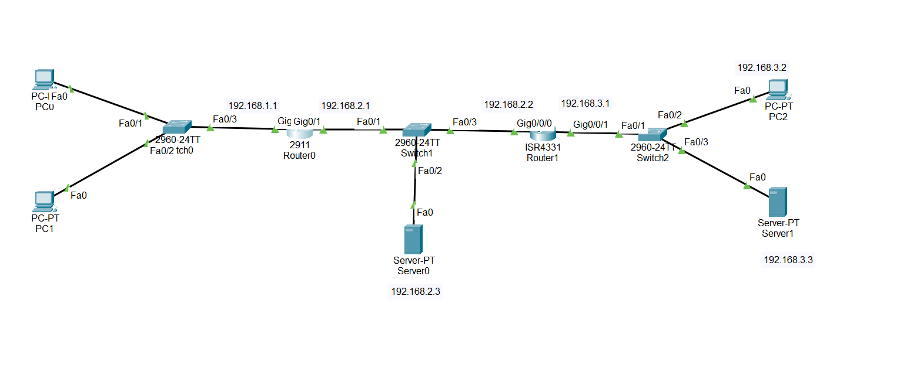
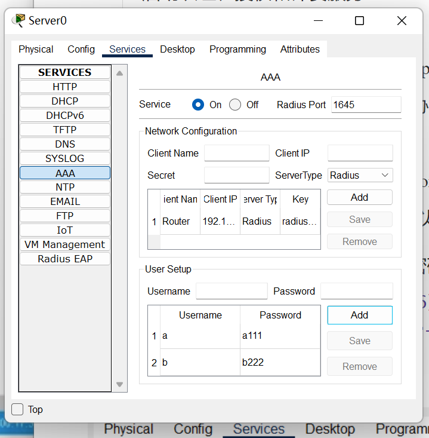
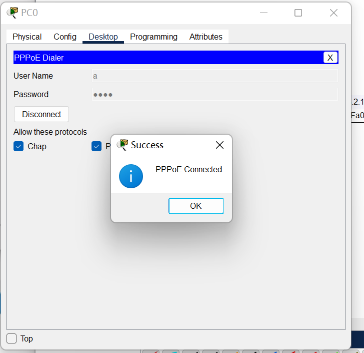
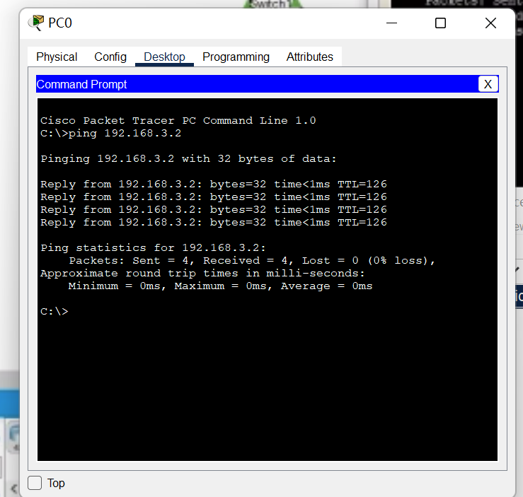
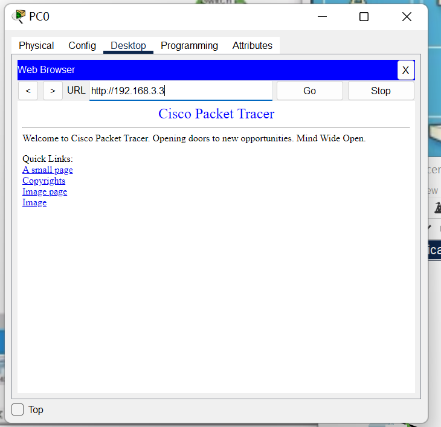
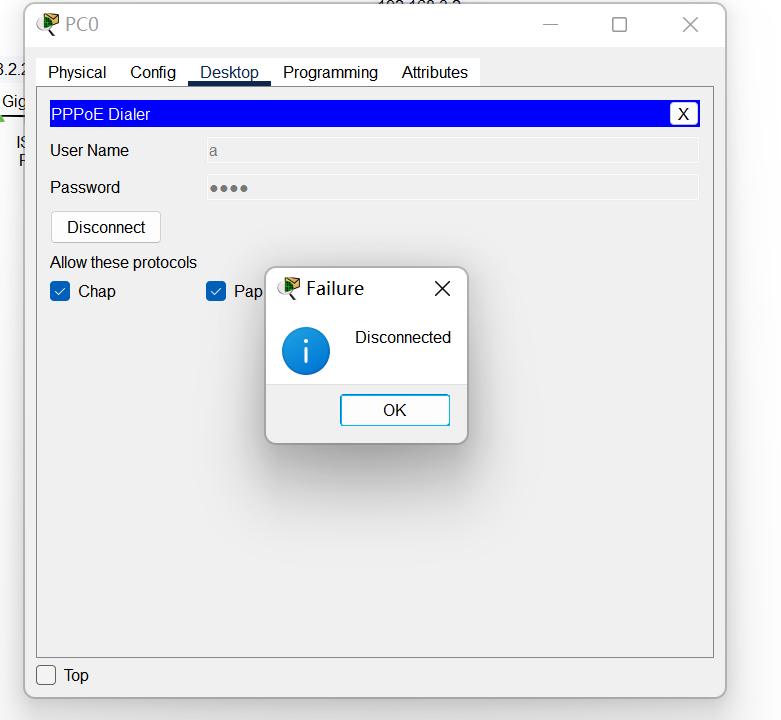
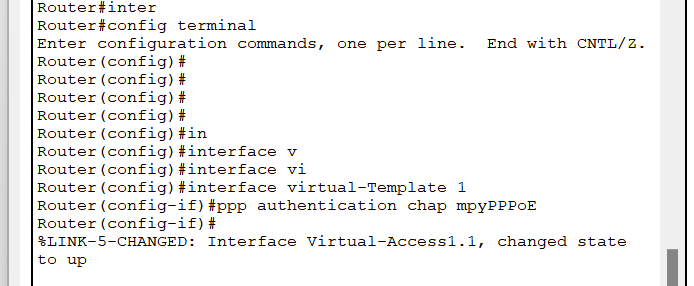

## lab8 PPPoE服务器的配置和应用

​														学号: 2111252       姓名: 李佳豪       时间:2023.12.20

PPPoE服务器配置和应用实验在虚拟仿真环境下完成，要求如下：

（1）仿真有线局域网接入互联网的场景，正确配置PPPoE服务器的认证协议、地址池、虚拟模板和物理接口，使内网用户经认证后才能正常访问外部互联网。

（2）仿真家庭网络中，无线和有线终端（主机、智能电话等）连入小型路由器，由小型路由器统一接入互联网服务运营商PPPoE服务器的场景。对小型路由器和PPPoE服务器进行设置，使家庭网络中的用户经认证后才能正常访问外部互联网。

[TOC]

##### 实验一：

###### 实验过程：

1. 配置网络拓扑，左侧两台主机无需静态配置ip、网关，设置自动即可。

   

2. 配置路由PPPoE认证

   在全局模式下，启动认证、授权和计费服务

   > aaa new-model  

   建立标号mypppoe的ppp验证方式 协议使用radius

   > aaa authentication ppp mypppoe group radius  

   配置到lsp服务器地址 使用端口1645 以及访问pppoe服务器使用的密码

   > radius-server host 192.168.2.3 auth-port 1645 key radius123 

3.  配置AAA服务器，添加"客户端"路由器信息（注意sercet和ServerType和刚刚路由器配置对应对应，以及ClientName在路由器自己界面查看，client ip则对应填），保存用户的账号密码

   

4. 配置路由参数

   - 配置本地地址池 指定用户可分配的ip地址

     >ip local pool `poolName` 192.168.1.100 192.168.1.200

   - 配置虚拟接口的模板，用户请求服务，创建模拟接口的模板

     >interface virtual-template 1 
     >
     >ip unnumbered fa0/0 // 为模板创建逻辑接口时没有ip地址 如果需要ip地址，则使用fa0/0的IP地址
     >
     >peer default ip address pool myPool   为模板选择myPool为用户分配地址
     >
     >ppp authentication chap mypppoe  为模板添加认证方式

   ~~~bash
   Router(config)#interface virtual-template 1
   Router(config-if)#ip unnumbered gig0/0
   Router(config-if)#
   Router(config-if)#peer default ip address pool myPool
   Router(config-if)#ppp authentication chap mpyPPPoE
   Router(config-if)#
   Router(config-if)#exit
   ~~~

   - BBA

     >bba-group pppoe myBBAGroup  //创建bba组设置网络接入其他参数
     >
     >virtual-template 1   //这个组使用的虚拟模板

   ~~~bash
   Router(config)#bba-group pppoe myBBAGroup
   Router(config-bba)#
   %LINK-5-CHANGED: Interface Virtual-Access2, changed state to up
   
   %LINEPROTO-5-UPDOWN: Line protocol on Interface Virtual-Access2, changed state to up
   
   Router(config-bba)#virtual-tem
   Router(config-bba)#virtual-template 1
   ~~~

   

   - 接口启用pppoe服务

     >interface fa0/0
     >
     >pppoe enable group myBBAGroup

   ~~~bash
   Router(config-bba)#interface gig0/0
   Router(config-if)#ppp
   Router(config-if)#pppoe enable group myBBAGroup
   ~~~

   

   

   

   ##### 实验验证，使用PC0连接PPPoE服务，连接外网PC，访问外网服务器，如下结果。

   

###### 一些问题：每一次重新启动cisco，启动PC的PPPoE服务失败。

此时需要重新配置路由虚拟接口，重新确认认证方式，再次PPPoE服务连接成功

