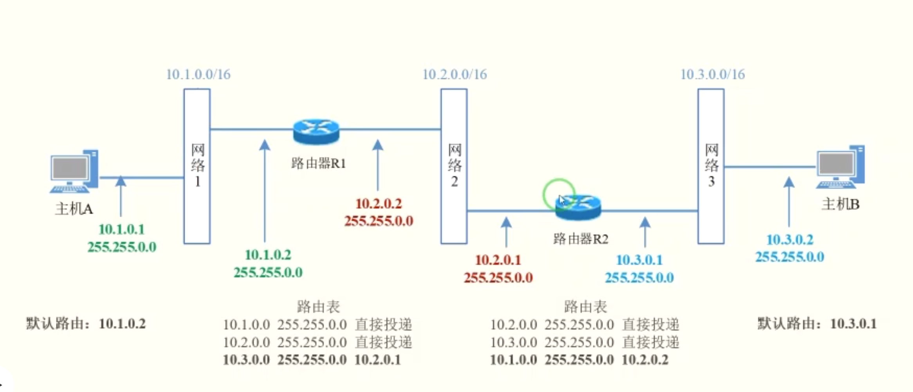

## 实验4：互联网组网与路由器配置

#### 1.实体环境下互联网组网与路由器配置

##### 实验内容：

在实体环境下完成互联网组网与路由器配置，要求如下：（1）在机房实验室环境下，通过将局域网划分为不同子网，用多IP主机作为路由器，组建互联网。（2）在命令行方式下，按照静态路由方式，配置路由器和主机，测试互联网的连通性。

##### 实验过程：

配置两台主机和两台路由器的IP

> PC0     10.1.0.1  255.255.0.0  10.1.0.2
>
> PC1     10.3.0.2  255.255.0.0  10.3.0.1
>
> Root0  10.1.0.2  255.255.0.0  
>
> ​			10.2.0.2  255.255.0.0
>
> Root1  10.2.0.1  255.255.0.0
>
> ​			10.3.0.1  255.255.0.0

配置方法如下:

> PC：在控制面版中打开`网络和共享中心`,选择`修改适配器设置`，打开`以太网`名称的网络连接，双击然后选择`IPv4`手动设置IP、掩码和网关
>
> ROOT：同样在控制面版找到以太网的网络接口，选择IPv4后，点击高级，选择添加，将两个IP地址、掩码添加。
>
> ROOT的路由表entry：`管理员身份`运行`命令提示符`，分别为其增加对应的`entry`
>
> 添加命令 `route ADD 10.3.0.0 MASK 255.255.0.0 10.2.0.1`
>
> ​				`route ADD 10.1.0.0 MASK 255.255.0.0 10.2.0.2`  
>
> 查看路由表项：`route PRINT`

打开路由转发功能

> `开始` -> `Windows管理工具` ->`服务`-> `Routing and Remote Access` 设置`启动类型`为`自动`或者`手动`，然后点击`应用`、点击`启动`。

将PC1防火墙关闭 

> `开始`-> `设置` ->`更新和安全`->`windows安全中心` ->`打开`->`防火墙和网络保护`->`公用网络` ->`关闭防火墙`

测试

> `Ping` 10.3.0.2
>
> `Tracert` 10.3.0.2
>
> ​	显示数据报走过的路径: 10.1.0.2  - > 10.2.0.1 -> 10.3.0.2
>
> 

#### 2.仿真环境下的互联网组网与路由器配置

##### 实验内容：

在仿真环境下完成互联网组网与路由器配置，要求如下：（1）学习路由器的配置方法和配置命令。（2）参考实体实验，组建由多个路由器组成的互联网。物理网络可以由集线器、交换机构成。（3）按照静态路由方式配置路由器和主机，测试互联网的连通性。（4）利用动态路由方式配置路由器和主机，测试互联网的连通性。（5）在仿真环境的“模拟”方式中观察数据包在互联网中的传递过程，并进行分析。

对于网络配置全部和实验室中的相同。

1. 首先在对路由表进行配置前，使用ping命令测试

   - 同一网段可以ping通\

     

   - 不同网段不可通

     

2. 打开路由器的`CLI`界面，分别配置路由表项，左侧路由需要添加`10.3.0.0`网段的表项，掩码`255.255.0.0`其对应的出口应当是右侧路由(对应接口是`gig0/1`)，对于右侧，添加`10.1.0.0`网段的表现，掩码`255.255.0.0`，出口为左侧路由(对应接口`gig0/1`)

   

   

3. 配置完毕，再进行`ping`命令，`10.1`网段对`10.3`进行`ping`，此时可以`ping`通；且运行`tracert`指令成功

   

